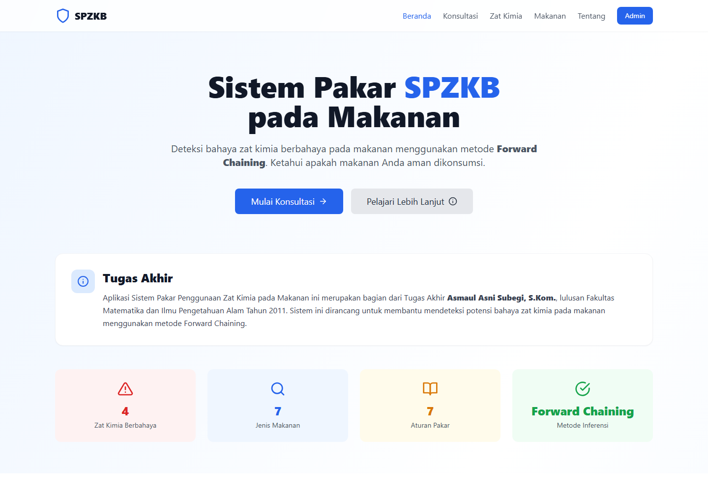
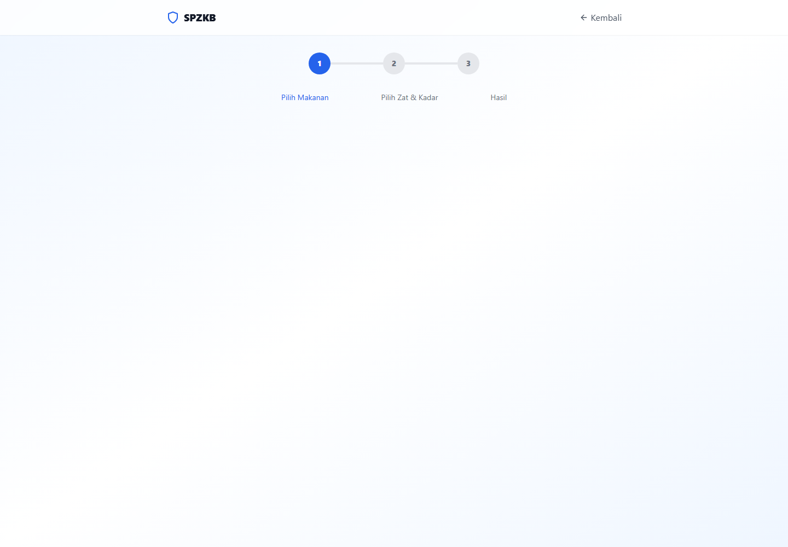
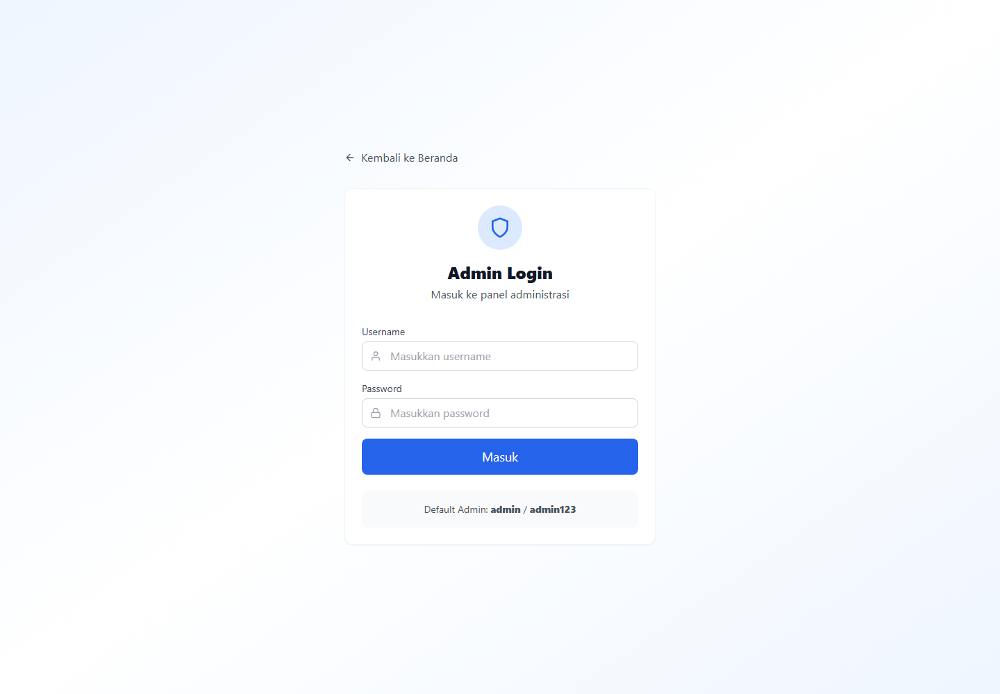
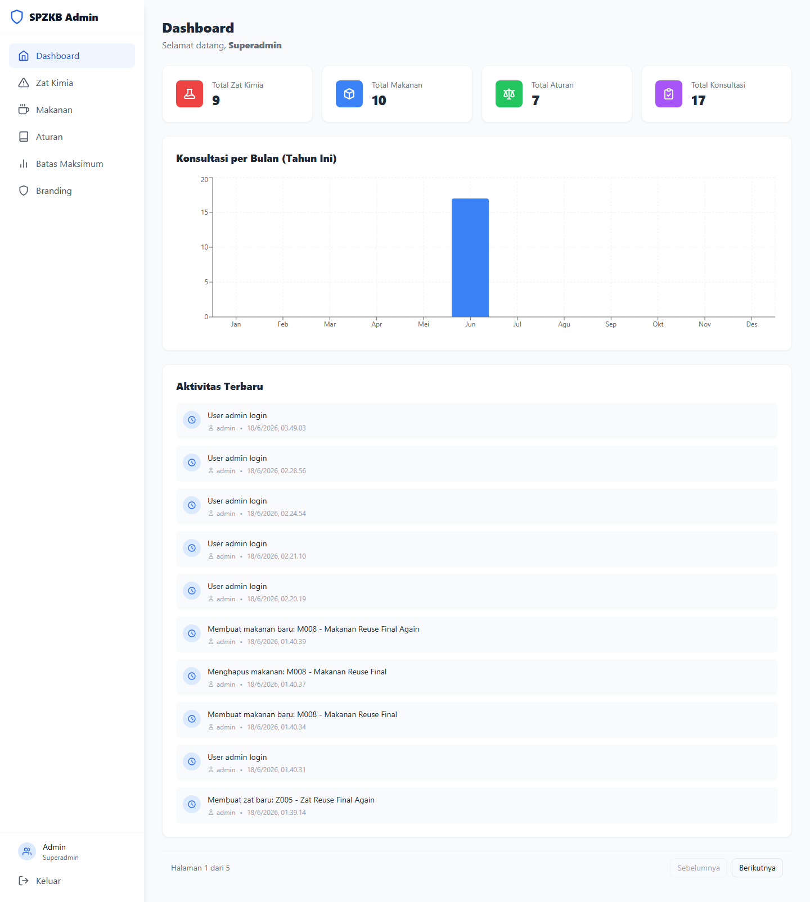
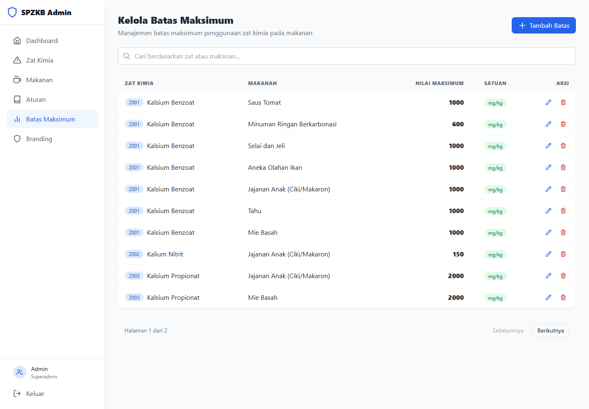

# Sistem Pakar Penggunaan Zat Kimia pada Makanan (SPZKB)

Expert system for detecting dangerous chemical substances in processed foods using the **Forward Chaining** method.

## 📋 Overview

SPZKB is a web-based expert system that helps users identify whether processed foods contain dangerous chemical substances. The system uses a knowledge base of rules (IF-THEN) to infer conclusions based on user input about food types and detected chemicals.

### Supported Chemicals
- **Formalin** (Z001) - Preservative
- **Boraks** (Z002) - Preservative/Texturizer
- **Rhodamin B** (Z003) - Synthetic Dye
- **Pemanis Buatan/Sakarin** (Z004) - Artificial Sweetener

### Supported Foods
- Tahu (Tofu)
- Mie Basah (Wet Noodles)
- Bakso (Meatballs)
- Kerupuk (Crackers)
- Minuman Ringan (Soft Drinks)
- Ikan Asin (Salted Fish)
- Jajanan Anak (Children's Snacks)

## 📸 Screenshots

### Landing Page


### Konsultasi


### Admin Login


### Admin Dashboard


### Admin Batas Maksimum


## 🚀 Quick Start

### Prerequisites
- Python 3.10+
- Node.js 18+
- npm or yarn

### Backend Setup

```bash
# Navigate to backend directory
cd backend

# Create virtual environment (optional but recommended)
python -m venv venv
source venv/bin/activate  # On Windows: venv\Scripts\activate

# Install dependencies
pip install -r requirements.txt

# Run seed data (populate database with knowledge base)
python ../seed_data.py

# Start the server
uvicorn app.main:app --reload --port 8000
```

The API will be available at `http://localhost:8000`
API Documentation: `http://localhost:8000/docs`

### Frontend Setup

```bash
# Navigate to frontend directory
cd frontend

# Install dependencies
npm install

# Start development server
npm run dev
```

The frontend will be available at `http://localhost:5173`

### Default Admin Account
- **Username:** admin
- **Password:** admin123

## 🐳 Docker Deployment

Local development:

```bash
docker-compose up --build

# Backend: http://localhost:8000
# Frontend: http://localhost:3000
```

Production deployment with domain and HTTPS:

1. Point your domain DNS to the VPS IP:

```text
Type: A
Name: spakar
Value: YOUR_VPS_IP
```

2. Copy production environment file:

```bash
cp .env.example .env
```

3. Edit `.env` and set a strong `SECRET_KEY`.

4. Start production stack:

```bash
docker compose -f docker-compose.prod.yml --env-file .env up -d --build
```

5. Open:

```text
https://spakar.sasskom.app
```

Production stack uses:
- Caddy for HTTPS
- Nginx for static frontend build
- FastAPI backend on `/api/*`
- SQLite data stored in Docker volume

Shared hosting / cPanel deployment:

Shared hosting usually cannot run Docker, Caddy, or a long-running FastAPI backend. For shared hosting, deploy the frontend as static files and host the backend separately on a Python/Docker-capable platform.

Frontend API base URL can be configured with:

```env
VITE_API_BASE_URL=/api
```

If the backend is hosted on another domain, set it to the full backend URL:

```env
VITE_API_BASE_URL=https://api.example.com/api
```


## 🏗️ Project Structure

```
spzkb/
├── backend/
│   ├── app/
│   │   ├── api/           # API route handlers
│   │   │   ├── auth.py
│   │   │   ├── zat.py
│   │   │   ├── makanan.py
│   │   │   ├── rule.py
│   │   │   ├── batas.py
│   │   │   ├── konsultasi.py
│   │   │   └── dashboard.py
│   │   ├── services/      # Business logic
│   │   │   ├── inference_engine.py
│   │   │   └── pdf_generator.py
│   │   ├── utils/         # Utilities
│   │   │   └── security.py
│   │   ├── config.py
│   │   ├── database.py
│   │   ├── models.py
│   │   ├── schemas.py
│   │   └── main.py
│   ├── Dockerfile
│   ├── requirements.txt
│   └── .env
├── frontend/
│   ├── src/
│   │   ├── components/    # React components
│   │   ├── context/       # React contexts
│   │   ├── App.jsx
│   │   ├── main.jsx
│   │   └── index.css
│   ├── package.json
│   ├── vite.config.js
│   ├── tailwind.config.js
│   └── index.html
├── seed_data.py           # Database seeder
├── docker-compose.yml
└── README.md
```

## 🔧 API Endpoints

### Public Endpoints
| Method | Endpoint | Description |
|--------|----------|-------------|
| POST | `/api/auth/login` | User login |
| POST | `/api/auth/register` | User registration |
| GET | `/api/zat` | List all chemicals |
| GET | `/api/zat/{id}` | Get chemical details |
| GET | `/api/makanan` | List all foods |
| GET | `/api/makanan/{id}` | Get food details |
| GET | `/api/makanan/{id}/zat` | Get chemicals by food |
| POST | `/api/konsultasi` | Submit consultation |
| GET | `/api/konsultasi/{id}/pdf` | Download PDF report |
| GET | `/api/konsultasi/{id}/excel` | Download Excel report |

### Admin Endpoints (Requires Authentication)
| Method | Endpoint | Description |
|--------|----------|-------------|
| POST | `/api/zat` | Create chemical |
| PUT | `/api/zat/{id}` | Update chemical |
| DELETE | `/api/zat/{id}` | Soft delete chemical |
| POST | `/api/makanan` | Create food |
| PUT | `/api/makanan/{id}` | Update food |
| DELETE | `/api/makanan/{id}` | Soft delete food |
| GET | `/api/rule` | List all rules |
| POST | `/api/rule` | Create rule |
| PUT | `/api/rule/{id}` | Update rule |
| DELETE | `/api/rule/{id}` | Delete rule |
| POST | `/api/rule/test` | Test a rule |
| GET | `/api/batas` | List max limits |
| POST | `/api/batas` | Create max limit |
| PUT | `/api/batas/{id}` | Update max limit |
| DELETE | `/api/batas/{id}` | Delete max limit |
| GET | `/api/konsultasi` | List consultations |
| GET | `/api/dashboard/stats` | Dashboard statistics |
| GET | `/api/dashboard/logs` | Activity logs |

## 🧠 Forward Chaining Method

The system uses Forward Chaining inference:

1. User selects a food type and chemicals detected
2. System checks all rules matching the food type
3. For each rule, system checks if antecedents (chemicals) match user input
4. If antecedents match, the rule's conclusion is triggered
5. System also compares detected levels against maximum limits
6. Final result: **AMAN** (Safe) or **BERBAHAYA** (Dangerous)

## 📄 License

This project is licensed under the **MIT License**.

Copyright (c) 2026 **asmaul asni subegi, S.Kom**

Developer: **asmaul asni subegi, S.Kom**  
Email: **sabayonx@gmail.com**

See [LICENSE](LICENSE) for details.
